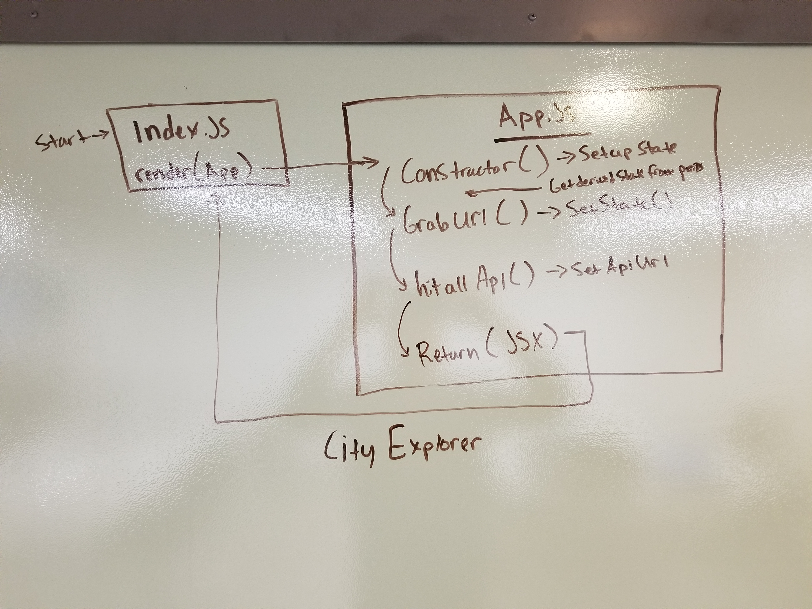

# City Explorer

### Challenge
To create a React front end for the provided City Explorer Express backend hosted at Heroku.

### Use
Click the `AWS deployed site` link below and enter the name of any city in the world you'd like to explore and we'll pull up some data that we think will help you make your travel decision. Be patient with Heroku as it might take 10-20sec to retrieve your results.

### Links and Resources
* [GitHub repo](https://github.com/EmeryP/city-explorer)
* [AWS deployed site](http://city-explorer-emery.s3-website-us-east-1.amazonaws.com/)

#### UML

